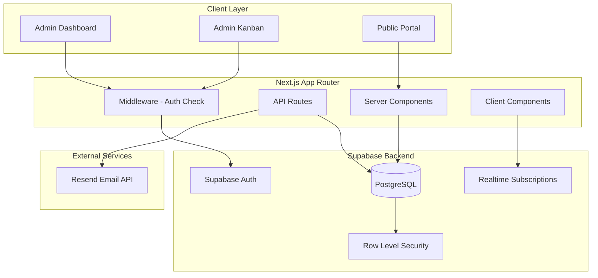

# Design Document

## Overview

ProjectLink is a Next.js 14+ application using the App Router pattern, built with TypeScript and styled with Tailwind CSS and Shadcn/UI components. The backend leverages Supabase for PostgreSQL database, authentication, Row Level Security, and real-time subscriptions. Email notifications are handled via Resend API.

The architecture follows a clear separation between:
- **Admin routes** (`/dashboard/*`) - Protected, authenticated access for the freelancer
- **Public routes** (`/portal/*`) - Unauthenticated access for clients via slug-based URLs
- **API routes** (`/api/*`) - Server-side endpoints for email notifications

## Architecture



## Components and Interfaces

### Supabase Client Utilities

```typescript
// utils/supabase/server.ts
interface SupabaseServerClient {
  createClient(): SupabaseClient;
  createServiceClient(): SupabaseClient; // For admin operations
}
```

### Data Access Layer

```typescript
// lib/projects.ts
interface ProjectService {
  getProjects(userId: string): Promise<Project[]>;
  getProjectById(projectId: string): Promise<Project | null>;
  getProjectBySlug(slug: string): Promise<Project | null>;
  createProject(userId: string, name: string): Promise<Project>;
  generateUniqueSlug(): string;
}

// lib/tickets.ts
interface TicketService {
  getTicketsByProject(projectId: string): Promise<Ticket[]>;
  getTicketById(ticketId: string): Promise<Ticket | null>;
  createTicket(data: CreateTicketInput): Promise<Ticket>;
  updateTicketStatus(ticketId: string, status: TicketStatus): Promise<Ticket>;
}

// lib/comments.ts
interface CommentService {
  getCommentsByTicket(ticketId: string): Promise<Comment[]>;
  createComment(data: CreateCommentInput): Promise<Comment>;
}
```

### UI Components

```typescript
// components/kanban/KanbanBoard.tsx
interface KanbanBoardProps {
  projectId: string;
  tickets: Ticket[];
  isAdmin: boolean;
  onStatusChange?: (ticketId: string, newStatus: TicketStatus) => void;
}

// components/kanban/KanbanColumn.tsx
interface KanbanColumnProps {
  status: TicketStatus;
  title: string;
  tickets: Ticket[];
  isAdmin: boolean;
}

// components/kanban/TicketCard.tsx
interface TicketCardProps {
  ticket: Ticket;
  isAdmin: boolean;
  onSelect: (ticket: Ticket) => void;
}

// components/tickets/TicketModal.tsx
interface TicketModalProps {
  ticket: Ticket | null;
  isOpen: boolean;
  onClose: () => void;
  isAdmin: boolean;
}

// components/tickets/NewTicketForm.tsx
interface NewTicketFormProps {
  projectId: string;
  onSuccess: () => void;
  onCancel: () => void;
}

// components/comments/CommentList.tsx
interface CommentListProps {
  comments: Comment[];
  ticketId: string;
  isAdmin: boolean;
}

// components/projects/ProjectCard.tsx
interface ProjectCardProps {
  project: Project;
  ticketCount: number;
}
```

## Data Models

### Database Schema

```sql
-- Projects table
CREATE TABLE projects (
  id UUID PRIMARY KEY DEFAULT gen_random_uuid(),
  user_id UUID NOT NULL REFERENCES auth.users(id) ON DELETE CASCADE,
  name TEXT NOT NULL,
  slug TEXT UNIQUE NOT NULL,
  created_at TIMESTAMPTZ DEFAULT NOW()
);

-- Tickets table
CREATE TABLE tickets (
  id UUID PRIMARY KEY DEFAULT gen_random_uuid(),
  project_id UUID NOT NULL REFERENCES projects(id) ON DELETE CASCADE,
  title TEXT NOT NULL,
  description TEXT,
  status TEXT NOT NULL DEFAULT 'todo' CHECK (status IN ('todo', 'in_progress', 'done')),
  priority TEXT NOT NULL DEFAULT 'medium' CHECK (priority IN ('low', 'medium', 'high')),
  created_at TIMESTAMPTZ DEFAULT NOW(),
  updated_at TIMESTAMPTZ DEFAULT NOW()
);

-- Comments table
CREATE TABLE comments (
  id UUID PRIMARY KEY DEFAULT gen_random_uuid(),
  ticket_id UUID NOT NULL REFERENCES tickets(id) ON DELETE CASCADE,
  author_name TEXT NOT NULL,
  content TEXT NOT NULL,
  is_admin BOOLEAN DEFAULT FALSE,
  created_at TIMESTAMPTZ DEFAULT NOW()
);

-- Indexes for performance
CREATE INDEX idx_projects_user_id ON projects(user_id);
CREATE INDEX idx_projects_slug ON projects(slug);
CREATE INDEX idx_tickets_project_id ON tickets(project_id);
CREATE INDEX idx_tickets_status ON tickets(status);
CREATE INDEX idx_comments_ticket_id ON comments(ticket_id);
```

### TypeScript Types

```typescript
// types/database.ts
type TicketStatus = 'todo' | 'in_progress' | 'done';
type TicketPriority = 'low' | 'medium' | 'high';

interface Project {
  id: string;
  user_id: string;
  name: string;
  slug: string;
  created_at: string;
}

interface Ticket {
  id: string;
  project_id: string;
  title: string;
  description: string | null;
  status: TicketStatus;
  priority: TicketPriority;
  created_at: string;
  updated_at: string;
}

interface Comment {
  id: string;
  ticket_id: string;
  author_name: string;
  content: string;
  is_admin: boolean;
  created_at: string;
}

interface CreateTicketInput {
  project_id: string;
  title: string;
  description?: string;
  priority: TicketPriority;
}

interface CreateCommentInput {
  ticket_id: string;
  author_name: string;
  content: string;
  is_admin: boolean;
}
```


## Correctness Properties

*A property is a characteristic or behavior that should hold true across all valid executions of a system-essentially, a formal statement about what the system should do. Properties serve as the bridge between human-readable specifications and machine-verifiable correctness guarantees.*

### Property 1: Slug Uniqueness
*For any* set of generated slugs, each slug SHALL be unique and non-empty.
**Validates: Requirements 1.1, 1.3**

### Property 2: Project Ownership Filtering
*For any* admin user and set of projects, querying projects SHALL return only projects where user_id matches the admin's ID.
**Validates: Requirements 1.2, 7.1**

### Property 3: Ticket Status Update Persistence
*For any* ticket and valid target status, updating the ticket status SHALL persist the new status and update the updated_at timestamp.
**Validates: Requirements 2.2, 4.5**

### Property 4: Admin Comment Flag
*For any* comment created by an admin, the is_admin flag SHALL be set to true.
**Validates: Requirements 2.4, 5.3**

### Property 5: Tickets By Slug Retrieval
*For any* valid project slug, fetching tickets SHALL return all tickets belonging to that project.
**Validates: Requirements 3.1**

### Property 6: New Ticket Default Status
*For any* newly created ticket, the status SHALL be "todo" regardless of any other input.
**Validates: Requirements 3.3**

### Property 7: Client Comment Constraints
*For any* comment created by a client, the is_admin flag SHALL be false and author_name SHALL be non-empty.
**Validates: Requirements 3.4, 5.2, 7.5**

### Property 8: Ticket Title Validation
*For any* string composed entirely of whitespace or empty, creating a ticket with that title SHALL be rejected.
**Validates: Requirements 4.1**

### Property 9: Priority Validation
*For any* ticket creation attempt, the priority SHALL be one of "low", "medium", or "high".
**Validates: Requirements 4.3**

### Property 10: Ticket Timestamp Initialization
*For any* newly created ticket, created_at and updated_at SHALL be set to valid timestamps.
**Validates: Requirements 4.4**

### Property 11: Comment-Ticket Association
*For any* comment and ticket, creating a comment with a ticket_id SHALL associate the comment with that ticket.
**Validates: Requirements 5.1**

### Property 12: Comment Chronological Order
*For any* set of comments on a ticket, retrieving comments SHALL return them sorted by created_at in ascending order.
**Validates: Requirements 5.4**

### Property 13: Email Notification Content
*For any* ticket, the notification email payload SHALL contain the ticket title, description, priority, and dashboard link.
**Validates: Requirements 6.2**

### Property 14: Unauthenticated Status Update Rejection
*For any* unauthenticated request to update ticket status, the operation SHALL be rejected.
**Validates: Requirements 7.3**

### Property 15: Unauthenticated Ticket Creation
*For any* valid ticket data submitted without authentication, the ticket SHALL be created successfully.
**Validates: Requirements 7.4**

### Property 16: Ticket Round-Trip Serialization
*For any* valid ticket object, serializing to the database and deserializing SHALL produce an equivalent ticket object.
**Validates: Requirements 9.3**

### Property 17: Project Round-Trip Serialization
*For any* valid project object, serializing to the database and deserializing SHALL produce an equivalent project object.
**Validates: Requirements 9.4**

### Property 18: Comment Round-Trip Serialization
*For any* valid comment object, serializing to the database and deserializing SHALL produce an equivalent comment object.
**Validates: Requirements 9.5**

## Error Handling

### Client-Side Errors
- **Form Validation**: Display inline error messages in Italian for invalid inputs
- **Network Errors**: Show toast notifications with retry options
- **Authentication Errors**: Redirect to login with return URL preserved

### Server-Side Errors
- **Database Errors**: Log to console, return generic error message to client
- **Email Service Errors**: Log error, continue with ticket creation (non-blocking)
- **RLS Violations**: Return 403 Forbidden with appropriate message

### Error Response Format
```typescript
interface ErrorResponse {
  error: string;
  code: string;
  details?: Record<string, string>;
}
```

## Testing Strategy

### Property-Based Testing Library
The project will use **fast-check** for property-based testing in TypeScript/JavaScript.

### Unit Tests
Unit tests will cover:
- Slug generation uniqueness
- Input validation functions
- Data transformation utilities
- Component rendering with specific props

### Property-Based Tests
Each correctness property will be implemented as a property-based test using fast-check with a minimum of 100 iterations.

Property tests will be tagged with the format:
`**Feature: project-link, Property {number}: {property_text}**`

Key property test areas:
1. **Data Model Properties**: Round-trip serialization for Project, Ticket, Comment
2. **Validation Properties**: Title validation, priority validation, author_name requirements
3. **Business Logic Properties**: Status transitions, timestamp updates, ownership filtering
4. **Security Properties**: RLS policy enforcement, admin flag constraints

### Test File Structure
```
__tests__/
├── properties/
│   ├── ticket.property.test.ts
│   ├── project.property.test.ts
│   ├── comment.property.test.ts
│   └── validation.property.test.ts
├── unit/
│   ├── slug.test.ts
│   ├── validation.test.ts
│   └── email.test.ts
└── integration/
    ├── api.test.ts
    └── rls.test.ts
```

### Test Configuration
- Property tests: 100 iterations minimum
- Use fast-check arbitraries for generating test data
- Mock Supabase client for unit tests
- Use test database for integration tests
